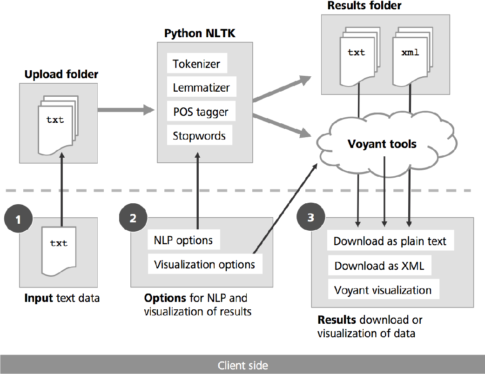
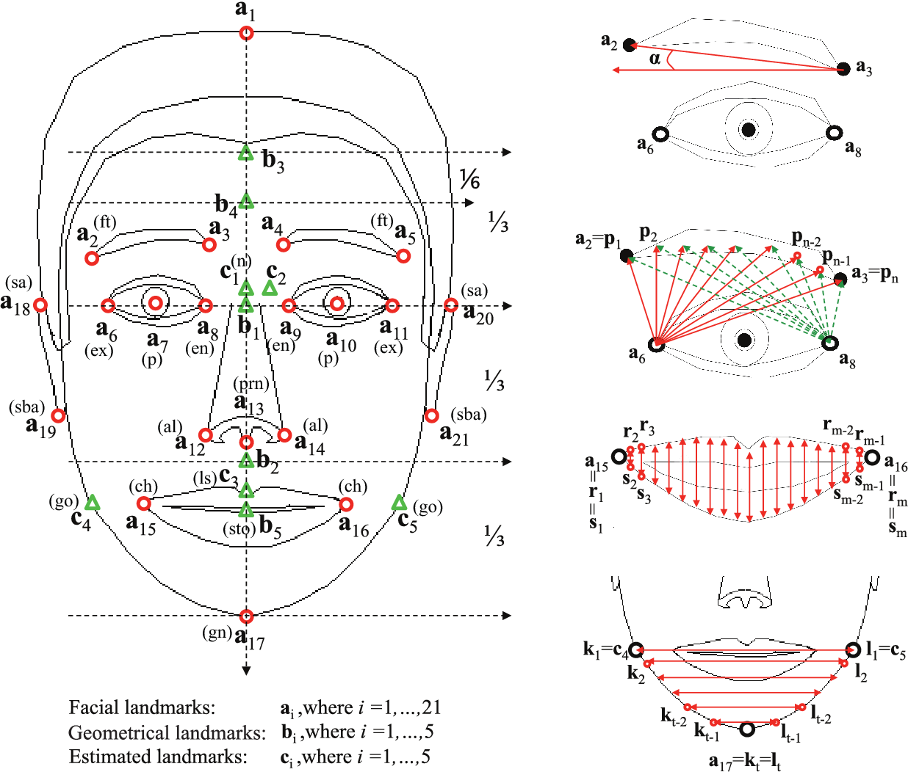
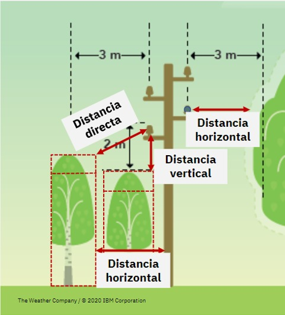
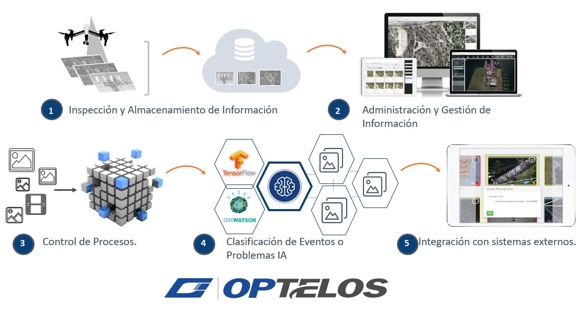
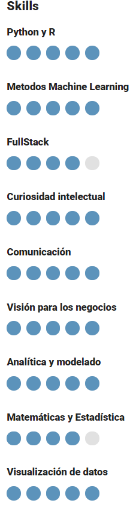

# Portfolio
## Data Science

### Modelo Predictivo de Tiempo Estimado de Reposicion Electrica.

Un modelo XGBoost construido en IBM Watson, el cual contiene atributos de clima, ubicacion geografica, tiempos de atencion. Actualmente se utiliza para predicir el tiempo que el cliente estara sin suministro, 15 min de haber llamado por su indisposicion electrica. La implementacion del Modelo fue realizado con Node-Red generando microservicios. En marzo del 2021 habia generado mas de 12.000.000 de predicciones donde el 75% de estas predicciones el cliente recibio una hora de reposicion positiva.

 

 

---
### Competencia de Kaggle: COVID-19 Open Research Dataset Challenge (CORD-19)

En esta competencia genere un Notebook con un procedimiento de busqueda de metadatos dentro de las publicaciones de medicina para ayudar a encontrar relaciones en condiciones que afectaba el virus, utilizando la libreria nltk 

 

 

---
### Prediccion de Demanda de Energia Electrica en Instalaciones.

En este cuaderno se genera un modelo para predecir el rendimiento energético segun tipo de instalación y con datos climaticos. Utilizando tecnicas de regresion con un modelo LGB

 

 

---
### API y Plataforma Web Reconocimiento Facial Python y Postgresql 

En este repositorio encontraras todo lo necesario para generar un modelo de reconocimiento facial y desplegarlo con webservice y un sistema web con operaciones para dar de alta y reconocer rostros 

 

El modelo de reconocimiento facial se conecta con postgresql con su libreria para guardar datos en CUDA, lo que permite registrar cientos de rostros y dar mejor performance al reconocimiento

 

 

---
### CS224n: Procesamiento del lenguaje natural con Deep Learning

Una implementación completa de asignaciones y proyectos en [***CS224n: Natural Language Processing with Deep Learning***](http://web.stanford.edu/class/cs224n/) por Stanford (Winter, 2019).

**Traducción automática neuronal:** Un sistema NMT que traduce textos del español al inglés utilizando un codificador LSTM bidireccional para la oración de origen y un decodificador LSTM unidireccional con atención multiplicativa para la oración de destino ([GitHub](https://github.com/script32/CS224n-NLP/tree/master/assignments)).

---
### Analisis de Sentimiento de Tweets

Un área principal de atención son los modelos de aprendizaje automático que pueden identificar la toxicidad en las conversaciones en línea, donde la toxicidad se define como cualquier cosa grosera, irrespetuosa o que pueda hacer que alguien abandone una discusión. Si se pueden identificar estas contribuciones tóxicas, podríamos tener una Internet más segura y colaborativa.

---
### Biblioteca de Modelos en Python y R

En este repositorio encontraras un ejemplo de todos los tipos de Modelos de ML, con un dataset de ejemplo, en lenguaje Python y R. Con esta gran biblioteca, y sumado los años de experiencia, el limite solo es la imaginacion

 

 

---

## Workshop Invierno 2020 UACH

Explicacion del viaje de como las empresas del Sector Utility deben adoptar la Inteligencia Artificial

 

---

---
## Workshop Primavera 2020 UACH

En esta oportunidad tuve el agrado de participar en este evento de la Universidad Austral de Chile para hacer una demostracion de la computacion visual y una implementacion en menos de 20 lineas de codigo.

 

---

## Rol de IT Business Partner

---
### Analisis de Vegetacion con Inteligencia Artificial.

Proyecto orientado a la inspeccion por medio de imagenes satelitales 11.500 Kilometros de Lineas electricas, detectando la vegetacion que tiene peligro o es necesario generar un trabajo en terreno a mediano plazo, generando beneficios de 9 MM USD.

 

---

---
### Analisis de Activos Imagenes de Drones.

Implementacion de la plataforma Optelos, la cual se entrenan cerebros de inteligencia artificial, en el cual puedes entrenar el mismo negocio, esto utiliza la novedosa herramienta de neurala, tambien se puede conectar con los servicios de Microsoft, actualmente tiene alojado mas de 300.000 imagenes de inspecciones de activos

 

---

### Skills

 

 

---

© 2021 Cristian Rodriguez. Powered by Jekyll.

---
