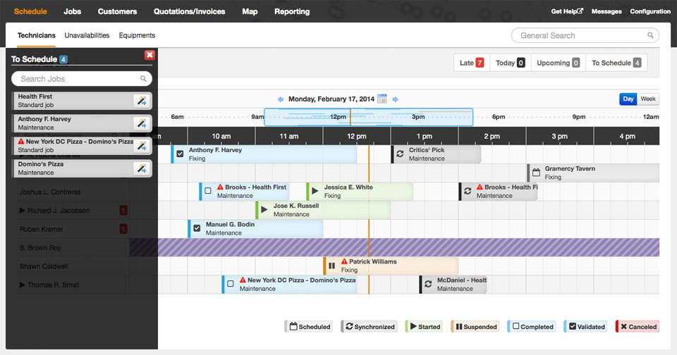
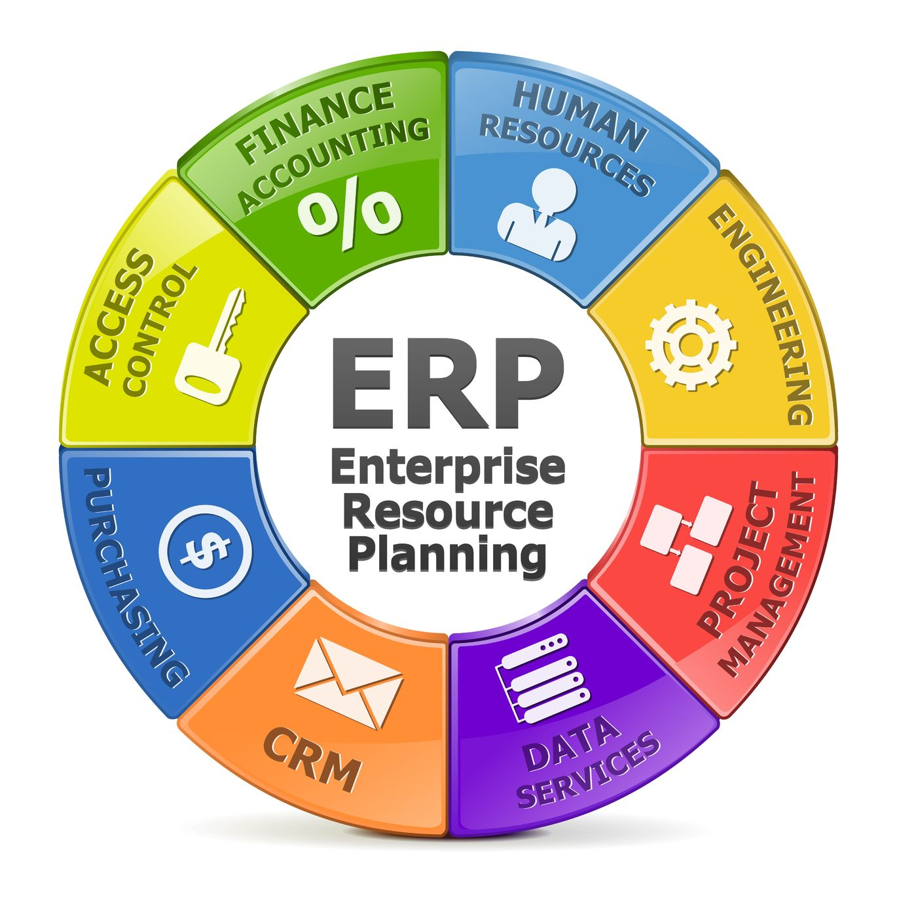

# Portfolio

## Rol de IT Business Partner

Este rol está orientado a entender las necesidades del negocio  y transformarlas en un proyecto de tecnología liderando los equipos de arquitectura, desarrollo, operaciones, presupuesto. Con mitología ágil o tradicional. 

 

### Proyectos de Desarrollo

En los proyectos de desarrollo en este Rol, he participado en más de 40 proyectos, los cuales están orientado al desarrollo de soluciones ya sea nuevas plataformas o desarrollos sobre los sistemas legados.

La tecnología utilizada:
- **Infraestructura en la Nube: Azure, IBM Cloud, AWS, Google Cloud**.
- **Base de datos: SQL Server, CloudAnt, Mysql, Postgresql**.
- **Front End: Angular, NodeJs, React**.
- **Back End: Angular, NodeJs, .Net Core**.

 

---
### Librería SSIS SAP CO: Exploración y Consultas Simples

 Este proyecto, desarrollado en C#, tiene como objetivo simplificar la interacción con las tablas SAP desde entornos de integración como SSIS (SQL Server Integration Services). La librería permite a los usuarios explorar de manera sencilla las tablas de SAP, generando consultas avanzadas y operaciones como joins sin necesidad de escribir código extenso o realizar configuraciones complejas.

Funcionalidades principales:
- **Exploración de tablas SAP**: Facilita la búsqueda y visualización de datos almacenados en las tablas SAP.
- **Generación de consultas personalizadas**: Crea consultas SQL optimizadas para filtrar, ordenar y transformar datos directamente desde SSIS.
- **Soporte para operaciones avanzadas**: Permite realizar joins y otras operaciones relacionales complejas de manera intuitiva.
- **Integración fluida con SSIS**: Diseñado para integrarse completamente con los flujos de trabajo de SSIS, lo que facilita la automatización de procesos de ETL (Extract, Transform, Load).

   

 

---

### Proyectos de gestión de fuerza de trabajo

 He implementado la plataforma Synchroteam para administrar la gestión de la fuerza de trabajo en terreno, para más de 300 Brigadas en terreno. La cual también permite la trazabilidad de los activos, recursos y materiales.

 

---

### Proyectos de SAP

He liderado y participado en distintas implementaciones de los módulos:

- **SAP PM**
    - **SAP PS**

También en integraciones y configuraciones como:

- **Liquidación automática de activos en proyectos**.
- **integración de valoración de presupuestos**.
- **Automatización de Planes de Mantenimiento**.
- **integración C4C y OMS**.

 

---

### Analisis de Vegetacion con Inteligencia Artificial.

Proyecto orientado a la inspección por medio de imágenes satelitales 11.500 kilómetros de líneas eléctricas, detectando la vegetación que tiene peligro o es necesario generar un trabajo en terreno a mediano plazo, generando beneficios de 9 MM USD.

 

---

### Análisis de Activos imágenes de Drones.

implementación de la plataforma Optelos, la cual se entrenan cerebros de inteligencia artificial, en el cual puedes entrenar el mismo negocio, esto utiliza la novedosa herramienta de neurala, también se puede conectar con los servicios de Microsoft, actualmente tiene alojado más de 300.000 imágenes de inspecciones de activos

 

---

## Data Science

### Modelo Predictivo de Tiempo Estimado de Reposicion Electrica.

Un modelo XGBoost construido en IBM Watson, el cual contiene atributos de clima, ubicación geográfica, tiempos de atención. Actualmente se utiliza para predecir el tiempo que el cliente estará sin suministro, 15 min de haber llamado por su indisposición eléctrica. La implementación del Modelo fue realizado con Node-Red generando microservicios. En marzo del 2021 había generado más de 12.000.000 de predicciones donde el 85% de estas predicciones el cliente recibió una hora de reposición positiva.

 

 

---
### Competencia de Kaggle: COVID-19 Open Research Dataset Challenge (CORD-19)

En esta competencia genere un Notebook con un procedimiento de busqueda de metadatos dentro de las publicaciones de medicina para ayudar a encontrar relaciones en condiciones que afectaba el virus, utilizando la librería nltk 

 

 

---
### Predicción de Demanda de energía eléctrica en Instalaciones.

En este cuaderno se genera un modelo para predecir el rendimiento energético segun tipo de instalación y con datos climáticos. Utilizando técnicas de regresión con un modelo LGB

 

 

---
### API y Plataforma Web Reconocimiento Facial Python y Postgresql 

En este repositorio encontraras todo lo necesario para generar un modelo de reconocimiento facial y desplegarlo con webservice y un sistema web con operaciones para dar de alta y reconocer rostros 

 

El modelo de reconocimiento facial se conecta con postgresql con su libreria para guardar datos en CUDA, lo que permite registrar cientos de rostros y dar mejor performance al reconocimiento

 

 

---
### CS224n: Procesamiento del lenguaje natural con Deep Learning

Una implementación completa de asignaciones y proyectos en [***CS224n: Natural Language Processing with Deep Learning***](http://web.stanford.edu/class/cs224n/) por Stanford (Winter, 2019).

**Traducción automática neuronal:** Un sistema NMT que traduce textos del español al inglés utilizando un codificador LSTM bidireccional para la oración de origen y un decodificador LSTM unidireccional con atención multiplicativa para la oración de destino ([GitHub](https://github.com/script32/CS224n-NLP/tree/master/assignments)).

---
### Analisis de Sentimiento de Tweets

Un área principal de atención son los modelos de aprendizaje automático que pueden identificar la toxicidad en las conversaciones en línea, donde la toxicidad se define como cualquier cosa grosera, irrespetuosa o que pueda hacer que alguien abandone una discusión. Si se pueden identificar estas contribuciones tóxicas, podríamos tener una Internet más segura y colaborativa.

---
### Biblioteca de Modelos en Python y R

En este repositorio encontraras un ejemplo de todos los tipos de Modelos de ML, con un dataset de ejemplo, en lenguaje Python y R. Con esta gran biblioteca, y sumado los años de experiencia, el limite solo es la imaginacion

 

 

---

## Workshop Invierno 2020 UACH

Explicacion del viaje de como las empresas del Sector Utility deben adoptar la Inteligencia Artificial

 

---

---
## Workshop Primavera 2020 UACH

En esta oportunidad tuve el agrado de participar en este evento de la Universidad Austral de Chile para hacer una demostracion de la computacion visual y una implementacion en menos de 20 lineas de codigo.

 

---

### Skills

 

 
    <table style="width:100%; border-collapse: collapse;">
        <tr style="background-color:#f2f2f2;">
            <th style="padding: 10px; text-align: center;">Categoría</th>
            <th style="padding: 10px; text-align: center;">Tecnologías</th>
            <th style="padding: 10px; text-align: center;">Nivel</th>
        </tr> 
            <tr> 
                <td style="padding: 10px; text-align: center;">Lenguajes de Programación</td> 
                <td style="padding: 10px; text-align: center;">  C# |  Python |  JavaScript </td> <td style="padding: 10px; text-align: center;">Experto</td> </tr> <tr> <td style="padding: 10px; text-align: center;">Bases de Datos</td> <td style="padding: 10px; text-align: center;">  SQL Server |  PostgreSQL |  MySQL </td> <td style="padding: 10px; text-align: center;">Avanzado</td> </tr> 
                <tr style="background-color:#f2f2f2;"> <td style="padding: 10px; text-align: center;">Nube e Infraestructura</td> <td style="padding: 10px; text-align: center;">  Azure |  AWS |  Google Cloud </td> <td style="padding: 10px; text-align: center;">Avanzado</td> </tr> 
                <tr> <td style="padding: 10px; text-align: center;">Frameworks y Librerías</td> <td style="padding: 10px; text-align: center;">  Angular |  React |  Node.js </td> <td style="padding: 10px; text-align: center;">Intermedio</td> </tr> </table> 

 

---

© 2024 Cristian Rodriguez. Powered by Jekyll.

---
