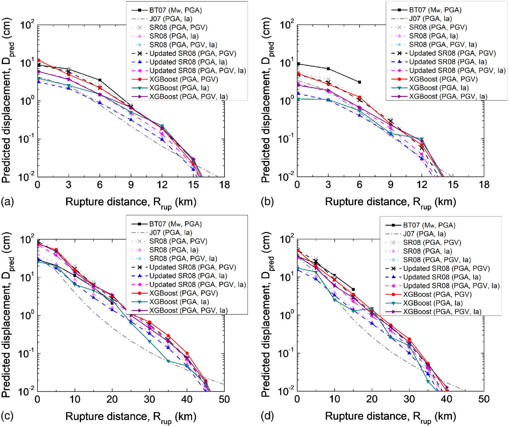
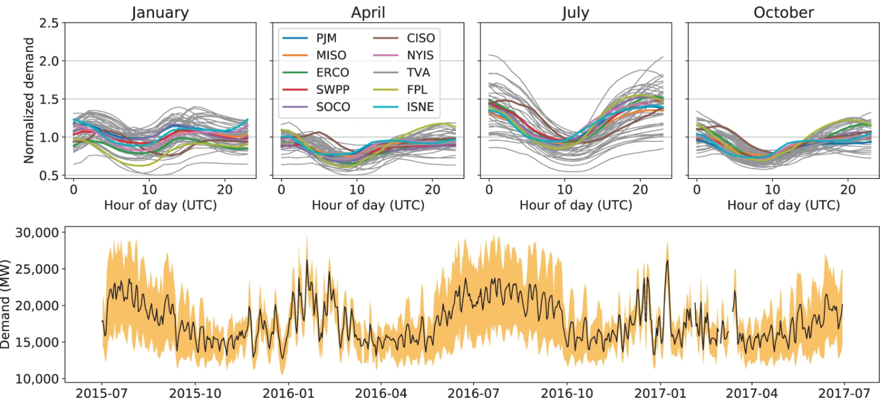
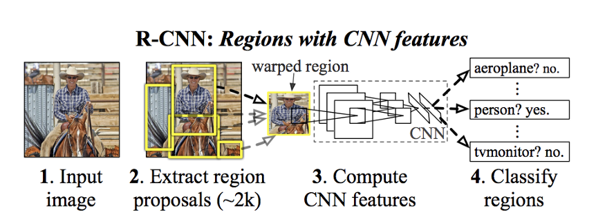

# Portfolio
## Data Science

### Modelo Predictivo de Tiempo Estimado de Reposicion Electrica.

Un modelo XGBoost construido en IBM Watson, el cual contiene atributos de clima, ubicacion geografica, tiempos de atencion. Actualmente se utiliza para predicir el tiempo que el cliente estara sin suministro, 15 min de haber llamado por su indisposicion electrica. La implementacion del Modelo fue realizado con Node-Red generando microservicios, En marzo del 2021 habia generado mas de 12.000.000 de predicciones donde el 75% de estas predicciones el cliente recibio una hora de reposicion positiva.

 

 

---
### Competencia de Kaggle: Predict Ames House Price using Lasso, Ridge, XGBoost and LightGBM

I performed comprehensive EDA to understand important variables, handled missing values, outliers, performed feature engineering, and ensembled machine learning models to predict house prices. My best model had Mean Absolute Error (MAE) of 12293.919, ranking <b>95/15502</b>, approximately <b>top 0.6%</b> in the Kaggle leaderboard.

 

 

---
### Prediccion de Demanda de Energia Electrica en Instalaciones.

En este cuaderno se genera un modelo para predecir el rendimiento energético segun tipo de instalación y con datos climaticos. Utilizando tecnicas de regresion con un modelo LGB

 

 

---

---
## Procesamiento de Lenguaje Natural

### CS224n: Procesamiento del lenguaje natural con Deep Learning

Una implementación completa de asignaciones y proyectos en [***CS224n: Natural Language Processing with Deep Learning***](http://web.stanford.edu/class/cs224n/) por Stanford (Winter, 2019).

**Traducción automática neuronal:** Un sistema NMT que traduce textos del español al inglés utilizando un codificador LSTM bidireccional para la oración de origen y un decodificador LSTM unidireccional con atención multiplicativa para la oración de destino ([GitHub](https://github.com/script32/CS224n-NLP/tree/master/assignments)).

**Análisis de dependencia:** Un sistema de análisis de dependencias basado en la transición neuronal con MLP de una capa ([GitHub](https://github.com/chriskhanhtran/CS224n-NLP-Assignments/tree/master/assignments/a3)).

---

### Analisis de Sentimiento de Tweets

Un área principal de atención son los modelos de aprendizaje automático que pueden identificar la toxicidad en las conversaciones en línea, donde la toxicidad se define como cualquier cosa grosera, irrespetuosa o que pueda hacer que alguien abandone una discusión. Si se pueden identificar estas contribuciones tóxicas, podríamos tener una Internet más segura y colaborativa.

---
### Detect Food Trends from Facebook Posts: Co-occurence Matrix, Lift and PPMI

First I build co-occurence matrices of ingredients from Facebook posts from 2011 to 2015. Then, to identify interesting and rare ingredient combinations that occur more than by chance, I calculate Lift and PPMI metrics. Lastly, I plot time-series data of identified trends to validate my findings. Interesting food trends have emerged from this analysis.

 

 

---
### Detect Spam Messages: TF-IDF and Naive Bayes Classifier

In order to predict whether a message is spam, first I vectorized text messages into a format that machine learning algorithms can understand using Bag-of-Word and TF-IDF. Then I trained a machine learning model to learn to discriminate between normal and spam messages. Finally, with the trained model, I classified unlabel messages into normal or spam.

 

 

---
## Workshop Invierno 2020 UACH

Explicacion del viaje de como las empresas del Sector Utility deben adoptar la Inteligencia Artificial

 

---

---
## Workshop Primavera 2020 UACH

En esta oportunidad tuve el agrado de participar en este evento de la Universidad Austral de Chile para hacer una demostracion de la computacion visual y una implementacion en menos de 20 lineas de codigo.

 

---

© 2021 Cristian Rodriguez. Powered by Jekyll.

