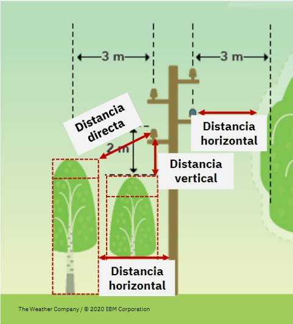
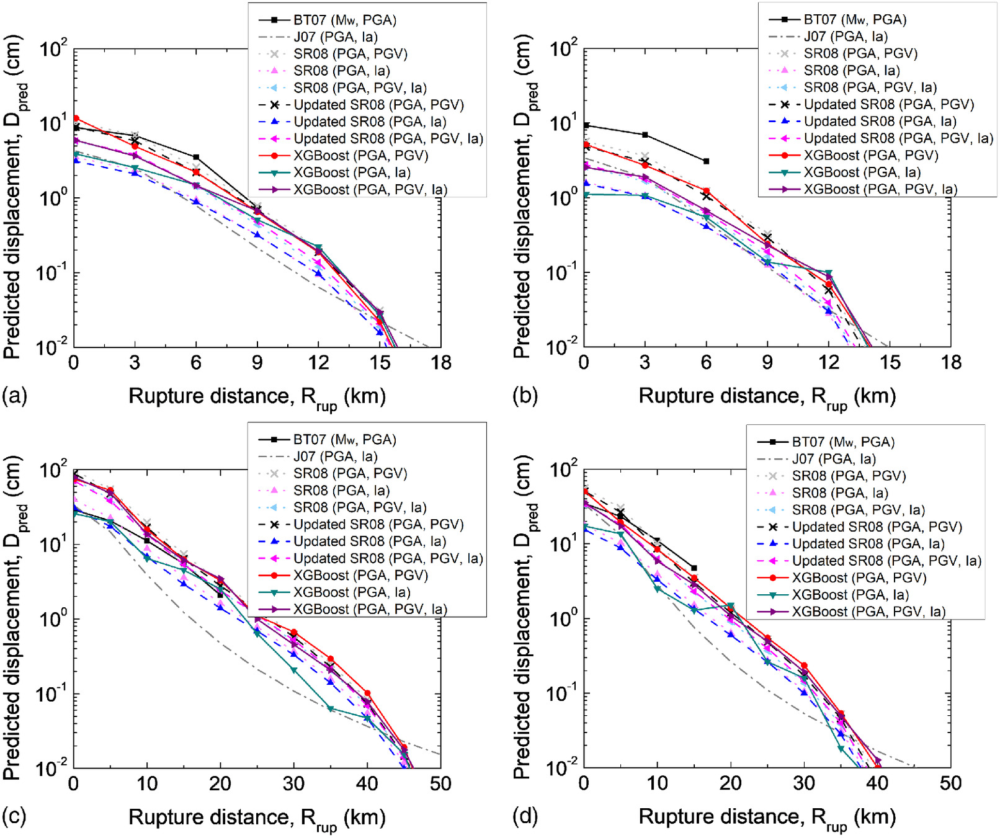
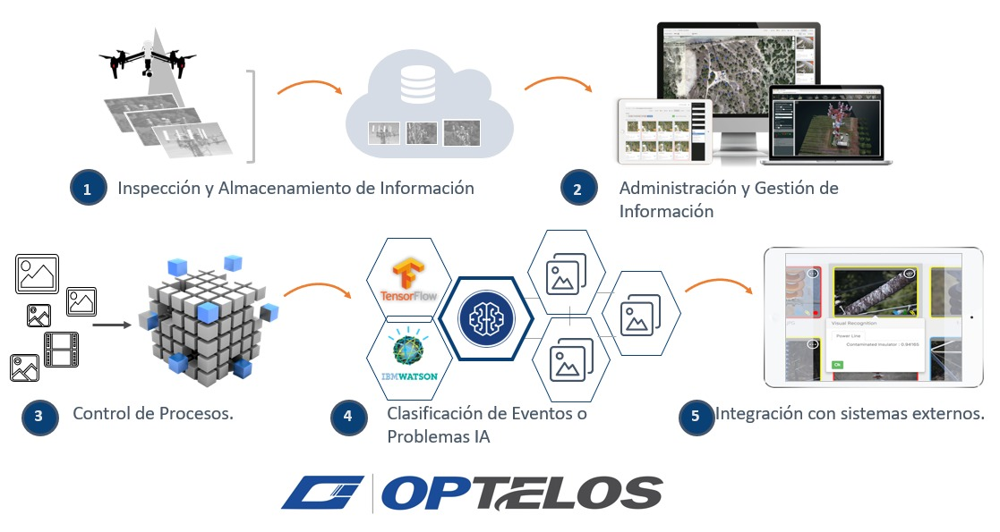
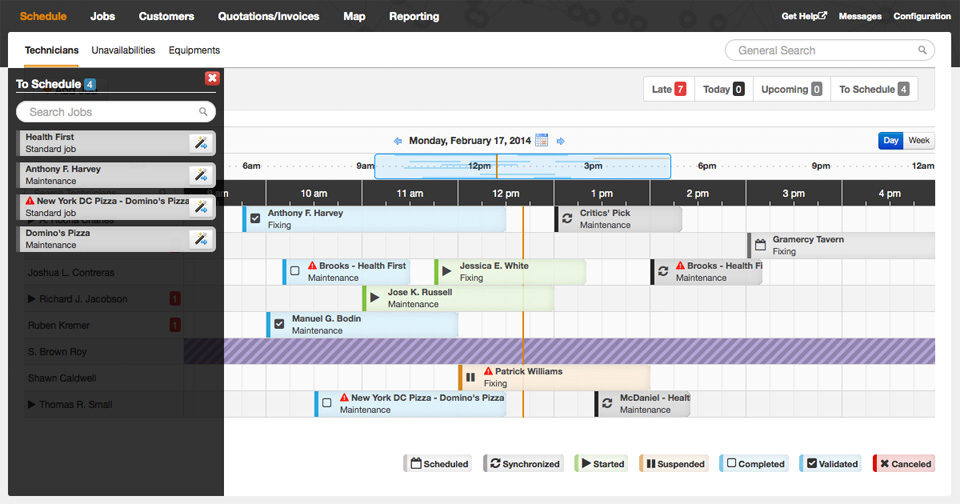
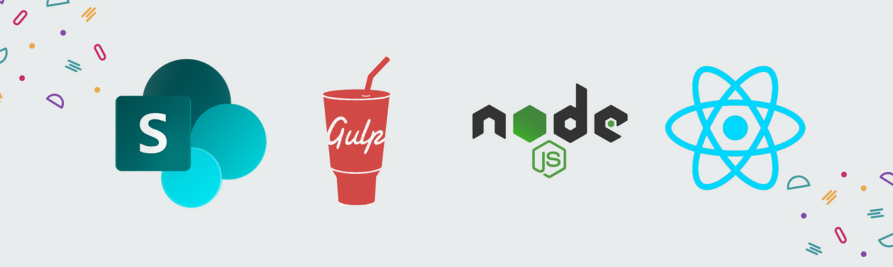
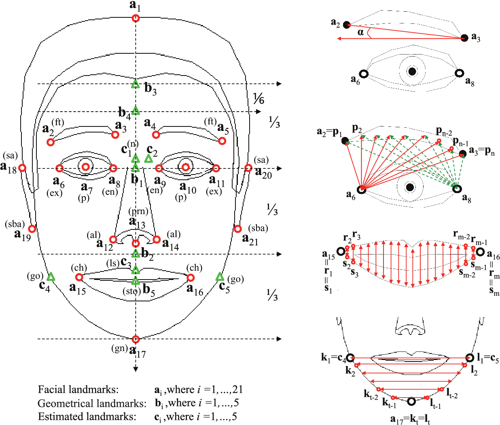
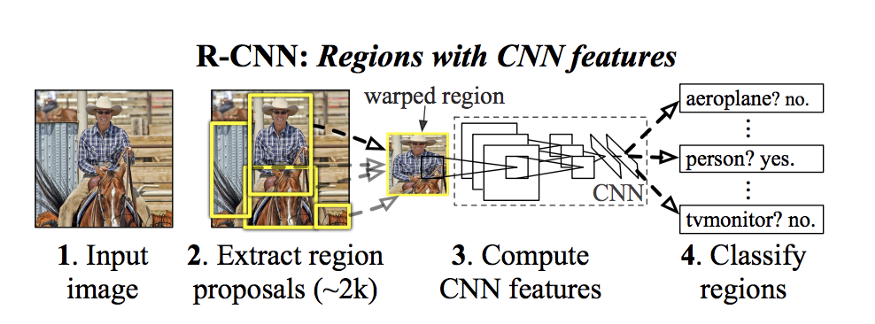

<!-- HERO GEOESPACIAL INTERACTIVO -->
<div class="geo-hero">
  <div id="map"></div>
  <div class="hero-overlay">
    <h1>Inteligencia Operativa para la Red Moderna</h1>
    <p>Transformando datos geoespaciales en acción operativa para el Sector Utility</p>
  </div>
</div>

<script>
document.addEventListener('DOMContentLoaded', function() {
  var map = L.map('map', {
    zoomControl: false,
    attributionControl: false,
    dragging: false,
    scrollWheelZoom: false
  }).setView([-33.45, -70.65], 10);
  
  L.tileLayer('https://{s}.basemaps.cartocdn.com/dark_all/{z}/{x}/{y}{r}.png', {
    maxZoom: 19
  }).addTo(map);
  
  var networkPoints = [
    [-33.42, -70.60], [-33.44, -70.62], [-33.46, -70.58],
    [-33.48, -70.64], [-33.45, -70.70], [-33.43, -70.68],
    [-33.47, -70.66], [-33.50, -70.62], [-33.41, -70.65]
  ];
  
  networkPoints.forEach(function(point, i) {
    L.circleMarker(point, {
      radius: 6,
      fillColor: i % 3 === 0 ? '#00ff88' : '#00aaff',
      color: '#fff',
      weight: 1,
      opacity: 0.8,
      fillOpacity: 0.8
    }).addTo(map);
  });
  
  var polyline = L.polyline(networkPoints, {
    color: '#00aaff',
    weight: 2,
    opacity: 0.6,
    dashArray: '5, 10'
  }).addTo(map);
});
</script>

<div style="text-align: center; margin: 30px 0;">
  <a href="https://www.linkedin.com/in/cristian-rodriguez-546a4150" class="cta-button" target="_blank">
    Colaborar en LinkedIn
  </a>
  <a href="https://github.com/script32" class="cta-button secondary" target="_blank">
    Ver Repositorios
  </a>
</div>

---

## Proyecto Estrella: Smart Agent Utility

<div class="project-card featured">

### El Desafío de las Operaciones de Campo

<div style="text-align: justify">
Los sistemas actuales en empresas de servicios públicos operan en <strong>silos de datos</strong>. Los trabajadores de campo carecen de inteligencia en tiempo real, dependiendo de información desactualizada que llega con horas o días de retraso. Esto resulta en:
</div>

- Tiempos de respuesta lentos ante emergencias
- Rutas subóptimas que desperdician recursos
- Falta de contexto sobre el estado real de los activos
- Decisiones basadas en datos incompletos

### La Solución: Agentes Autónomos Inteligentes

<div style="text-align: justify">
<strong>Smart Agent Utility</strong> es un sistema de agentes autónomos que utiliza la <em>ubicación del trabajador en tiempo real</em> para enviar información contextual proactiva. El agente analiza múltiples fuentes de datos y toma decisiones para empoderar a los equipos de campo.
</div>

<div class="tech-stack">
  <span class="tech-badge">Python</span>
  <span class="tech-badge">PostGIS</span>
  <span class="tech-badge">Machine Learning</span>
  <span class="tech-badge">Real-time APIs</span>
  <span class="tech-badge">Cloud Native</span>
</div>

[](https://github.com/script32/smart_agent_utility)

</div>

---

## Arquitectura de Sistemas

<div style="text-align: justify">
Mi enfoque va más allá de escribir scripts; diseño <strong>sistemas completos</strong> que integran múltiples capas de tecnología. La siguiente arquitectura muestra cómo los componentes interactúan en mis proyectos para el sector Utility:
</div>

```
┌─────────────────────────────────────────────────────────────────┐
│                    CAPA DE PRESENTACIÓN                         │
│  ┌──────────┐  ┌──────────┐  ┌──────────┐  ┌──────────┐       │
│  │  React   │  │  Mobile  │  │Dashboard │  │  Maps    │       │
│  │   SPFx   │  │   App    │  │   BI     │  │ Leaflet  │       │
│  └────┬─────┘  └────┬─────┘  └────┬─────┘  └────┬─────┘       │
└───────┼─────────────┼─────────────┼─────────────┼──────────────┘
        │             │             │             │
┌───────┴─────────────┴─────────────┴─────────────┴──────────────┐
│                      CAPA DE SERVICIOS                          │
│  ┌──────────────────────────────────────────────────────────┐  │
│  │              APIs REST / GraphQL / Node-RED              │  │
│  │         ┌─────────────────────────────────┐              │  │
│  │         │     SMART AGENT UTILITY         │              │  │
│  │         │   (Decisiones Autónomas IA)     │              │  │
│  │         └─────────────────────────────────┘              │  │
│  └──────────────────────────────────────────────────────────┘  │
└─────────────────────────────────────────────────────────────────┘
        │             │             │             │
┌───────┴─────────────┴─────────────┴─────────────┴──────────────┐
│                       CAPA DE DATOS                             │
│  ┌──────────┐  ┌──────────┐  ┌──────────┐  ┌──────────┐       │
│  │ PostGIS  │  │   SAP    │  │  IBM     │  │  Azure   │       │
│  │PostgreSQL│  │  HANA    │  │ Watson   │  │   SQL    │       │
│  └──────────┘  └──────────┘  └──────────┘  └──────────┘       │
└─────────────────────────────────────────────────────────────────┘
```

---

## Proyectos de Alto Impacto - Sector Utility

<div class="project-card">
<h3>Análisis de Vegetación con IA - ROI: $9M USD</h3>

<div style="text-align: justify">
Proyecto de inspección mediante <strong>imágenes satelitales</strong> de 11,500 kilómetros de líneas eléctricas. El sistema detecta vegetación de riesgo y programa trabajos preventivos en terreno, generando beneficios de <strong>9 millones USD</strong> en prevención de fallas.
</div>

<div class="tech-stack">
  <span class="tech-badge">Imágenes Satelitales</span>
  <span class="tech-badge">Computer Vision</span>
  <span class="tech-badge">Python</span>
  <span class="tech-badge">GIS</span>
</div>

<center></center>
</div>

<div class="project-card">
<h3>Modelo Predictivo de Tiempo de Reposición Eléctrica</h3>

<div style="text-align: justify">
Modelo <strong>XGBoost</strong> desplegado en IBM Watson que predice el tiempo de reposición del servicio eléctrico en los primeros 15 minutos de una llamada de cliente. Integra datos de clima, ubicación geográfica y tiempos históricos de atención.
</div>

<div class="github-stats">
  <div class="stat-card">
    <div class="number">12M+</div>
    <div class="label">Predicciones Generadas</div>
  </div>
  <div class="stat-card">
    <div class="number">85%</div>
    <div class="label">Precisión Positiva</div>
  </div>
  <div class="stat-card">
    <div class="number">15 min</div>
    <div class="label">Tiempo de Respuesta</div>
  </div>
</div>

<div class="tech-stack">
  <span class="tech-badge">XGBoost</span>
  <span class="tech-badge">IBM Watson</span>
  <span class="tech-badge">Node-RED</span>
  <span class="tech-badge">Weather API</span>
</div>

<center></center>
</div>

<div class="project-card">
<h3>Análisis de Activos con Drones - 300K+ Imágenes</h3>

<div style="text-align: justify">
Implementación de la plataforma <strong>Optelos</strong> con cerebros de IA entrenados para inspección de activos. El sistema utiliza tecnología Neurala y se integra con servicios de Microsoft Azure, gestionando más de <strong>300,000 imágenes</strong> de inspecciones.
</div>

<div class="tech-stack">
  <span class="tech-badge">Drones</span>
  <span class="tech-badge">Neurala AI</span>
  <span class="tech-badge">Azure</span>
  <span class="tech-badge">Computer Vision</span>
</div>

<center></center>
</div>

<div class="project-card">
<h3>Gestión de Fuerza de Trabajo - 300+ Brigadas</h3>

<div style="text-align: justify">
Implementación de <strong>Synchroteam</strong> para administrar la gestión de fuerza de trabajo en terreno. El sistema permite la trazabilidad completa de activos, recursos y materiales para más de 300 brigadas operativas.
</div>

<div class="tech-stack">
  <span class="tech-badge">Geolocalización</span>
  <span class="tech-badge">Mobile</span>
  <span class="tech-badge">Real-time Sync</span>
  <span class="tech-badge">Analytics</span>
</div>

<center></center>
</div>

---

## Integraciones Empresariales

<div class="project-card">
<h3>Librería SSIS SAP CO - ETL Avanzado</h3>

<div style="text-align: justify">
Librería desarrollada en <strong>C#</strong> para simplificar la interacción con tablas SAP desde SSIS. Permite explorar tablas, generar consultas optimizadas y realizar operaciones JOIN complejas sin código extenso.
</div>

**Funcionalidades:**
- Exploración intuitiva de tablas SAP
- Generación automática de consultas SQL
- Soporte para JOINs y operaciones relacionales
- Integración fluida con flujos ETL

<div class="tech-stack">
  <span class="tech-badge">C#</span>
  <span class="tech-badge">SSIS</span>
  <span class="tech-badge">SAP RFC</span>
  <span class="tech-badge">SQL Server</span>
</div>

<center></center>
</div>

<div class="project-card">
<h3>SharePoint - Gestión del Conocimiento con React SPFx</h3>

<div style="text-align: justify">
Plataforma de gestión del conocimiento para empresa multinacional utilizando <strong>React</strong> y <strong>SPFx</strong>. Centraliza el acceso a información con seguridad basada en roles y búsqueda avanzada mediante Graph API.
</div>

<div class="tech-stack">
  <span class="tech-badge">React</span>
  <span class="tech-badge">SPFx</span>
  <span class="tech-badge">Graph API</span>
  <span class="tech-badge">Role-based Security</span>
</div>

<center></center>
</div>

<div class="project-card">
<h3>Proyectos SAP PM/PS</h3>

<div style="text-align: justify">
Liderazgo en implementaciones de módulos <strong>SAP PM</strong> (Plant Maintenance) y <strong>SAP PS</strong> (Project Systems) con integraciones avanzadas.
</div>

**Implementaciones:**
- Liquidación automática de activos en proyectos
- Integración de valoración de presupuestos
- Automatización de Planes de Mantenimiento
- Integración C4C y OMS

<div class="tech-stack">
  <span class="tech-badge">SAP PM</span>
  <span class="tech-badge">SAP PS</span>
  <span class="tech-badge">ABAP</span>
  <span class="tech-badge">Integration</span>
</div>

<center></center>
</div>

---

## Data Science & Machine Learning

<div class="project-card">
<h3>COVID-19 Research Challenge - Kaggle</h3>

[](https://www.kaggle.com/crprpr/vaccine-data-filter)

<div style="text-align: justify">
Notebook para búsqueda de metadatos en publicaciones médicas utilizando <strong>NLP</strong> para encontrar relaciones en condiciones afectadas por el virus.
</div>

<div class="tech-stack">
  <span class="tech-badge">Python</span>
  <span class="tech-badge">NLTK</span>
  <span class="tech-badge">NLP</span>
</div>
</div>

<div class="project-card">
<h3>Predicción de Demanda Energética</h3>

[](https://colab.research.google.com/drive/1gVBN1qg3ajEjxJPkd_YwXb9yLDBMQAR0)

<div style="text-align: justify">
Modelo <strong>LightGBM</strong> para predecir rendimiento energético según tipo de instalación y datos climáticos.
</div>

<div class="tech-stack">
  <span class="tech-badge">LightGBM</span>
  <span class="tech-badge">Weather Data</span>
  <span class="tech-badge">Regression</span>
</div>
</div>

<div class="project-card">
<h3>Reconocimiento Facial - API + Web Platform</h3>

[](https://github.com/script32/face)

<div style="text-align: justify">
Sistema completo de reconocimiento facial con API REST y plataforma web. Utiliza <strong>PostgreSQL con CUDA</strong> para almacenar embeddings faciales con alto rendimiento.
</div>

<div class="tech-stack">
  <span class="tech-badge">Python</span>
  <span class="tech-badge">PostgreSQL</span>
  <span class="tech-badge">CUDA</span>
  <span class="tech-badge">REST API</span>
</div>

<center></center>
</div>

<div class="project-card">
<h3>CS224n: NLP con Deep Learning - Stanford</h3>

[](https://github.com/script32/CS224n-NLP)

<div style="text-align: justify">
Implementación completa del curso de Stanford. Incluye sistema de <strong>Traducción Automática Neuronal</strong> (NMT) español-inglés con encoder LSTM bidireccional y decoder con atención multiplicativa.
</div>

<div class="tech-stack">
  <span class="tech-badge">Deep Learning</span>
  <span class="tech-badge">NLP</span>
  <span class="tech-badge">LSTM</span>
  <span class="tech-badge">Attention</span>
</div>

<center></center>
</div>

<div class="project-card">
<h3>Análisis de Sentimiento - Detección de Toxicidad</h3>

[](https://www.kaggle.com/crprpr/clasificaci-n-de-texto-tensorflow-transformers)

<div style="text-align: justify">
Modelos de ML para identificar toxicidad en conversaciones online utilizando <strong>BERT</strong> y Transformers.
</div>

<div class="tech-stack">
  <span class="tech-badge">BERT</span>
  <span class="tech-badge">TensorFlow</span>
  <span class="tech-badge">Transformers</span>
</div>

<center></center>
</div>

<div class="project-card">
<h3>Biblioteca de Modelos ML - Python & R</h3>

[](https://github.com/script32/Modelos-ML)

<div style="text-align: justify">
Repositorio completo con ejemplos de todos los tipos de modelos de Machine Learning, implementados en <strong>Python</strong> y <strong>R</strong> con datasets de ejemplo.
</div>

<div class="tech-stack">
  <span class="tech-badge">Python</span>
  <span class="tech-badge">R</span>
  <span class="tech-badge">Scikit-learn</span>
  <span class="tech-badge">XGBoost</span>
</div>

<center></center>
</div>

---

## Charlas y Eventos

<div class="project-card">
<h3>Workshop Invierno 2020 - Universidad Austral de Chile</h3>

[](https://youtu.be/XnX3HJDSIgU?t=8905)

<div style="text-align: justify">
Presentación sobre el viaje de transformación digital: <em>"Cómo las empresas del Sector Utility deben adoptar la Inteligencia Artificial"</em>
</div>

<center></center>
</div>

<div class="project-card">
<h3>Workshop Primavera 2020 - Computación Visual</h3>

[](https://youtu.be/4eFyjwE3bCM?t=5576)
[](https://colab.research.google.com/drive/1l4UfnvcbBgybtc16pJcIGuh41ETbXsF3)

<div style="text-align: justify">
Demostración práctica de computación visual con implementación en menos de 20 líneas de código.
</div>

<center></center>
</div>

---

## Stack Tecnológico

<div class="skills-grid">

<div class="skill-category">
<h4>Lenguajes de Programación</h4>

| Tecnología | Nivel |
|------------|-------|
| Python | Experto |
| C# / .NET | Experto |
| JavaScript/TypeScript | Experto |
| R | Avanzado |
| SQL | Experto |

</div>

<div class="skill-category">
<h4>Bases de Datos & GIS</h4>

| Tecnología | Nivel |
|------------|-------|
| PostgreSQL / PostGIS | Experto |
| SQL Server | Experto |
| MySQL | Avanzado |
| MongoDB | Avanzado |
| SAP HANA | Avanzado |

</div>

<div class="skill-category">
<h4>Cloud & DevOps</h4>

| Tecnología | Nivel |
|------------|-------|
| Azure | Experto |
| AWS | Avanzado |
| Google Cloud | Avanzado |
| IBM Cloud / Watson | Experto |
| Docker | Avanzado |

</div>

<div class="skill-category">
<h4>Frameworks & Librerías</h4>

| Tecnología | Nivel |
|------------|-------|
| React / SPFx | Experto |
| Angular | Avanzado |
| Node.js | Experto |
| .NET Core | Experto |
| TensorFlow/PyTorch | Avanzado |

</div>

</div>

---

## Prácticas de Desarrollo Seguro

<div style="text-align: justify">
Como profesional en el <strong>Sector Utility</strong> —infraestructura crítica—, la seguridad es parte integral de mi práctica de desarrollo:
</div>

- **DevSecOps**: Integración de seguridad en pipelines CI/CD
- **Análisis de Dependencias**: Monitoreo automatizado con Dependabot
- **Code Review**: Revisión de código con enfoque en vulnerabilidades
- **Principio de Mínimo Privilegio**: Control de acceso granular
- **Encriptación**: Datos en tránsito y en reposo

---

## Colaboremos

<div class="mission-statement">
¿Buscas transformar las operaciones de campo de tu empresa de servicios públicos con inteligencia artificial y análisis geoespacial? Conversemos sobre cómo podemos innovar juntos.
</div>

<div style="text-align: center; margin: 30px 0;">
  <a href="https://www.linkedin.com/in/cristian-rodriguez-546a4150" class="cta-button" target="_blank">
    Conectar en LinkedIn
  </a>
  <a href="https://github.com/script32" class="cta-button secondary" target="_blank">
    Explorar Código
  </a>
  <a href="https://www.kaggle.com/crprpr" class="cta-button" target="_blank" style="background: linear-gradient(135deg, #20BEFF, #0088cc);">
    Ver en Kaggle
  </a>
</div>

---

<center style="color: #666; font-size: 0.9em;">
© 2025 Cristian Rodriguez | Script32 Labs<br>
Arquitecto de Soluciones Geoespaciales para el Sector Utility<br>
<em>Transformando datos en acción operativa</em>
</center>
